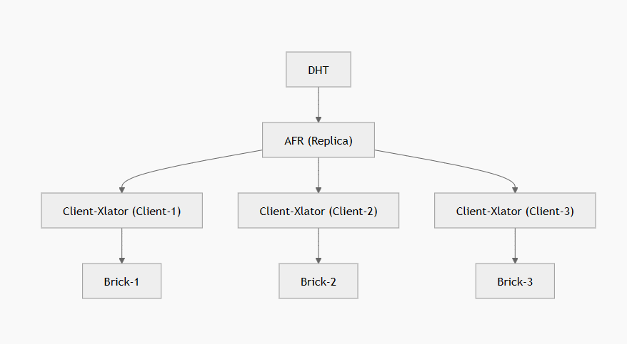
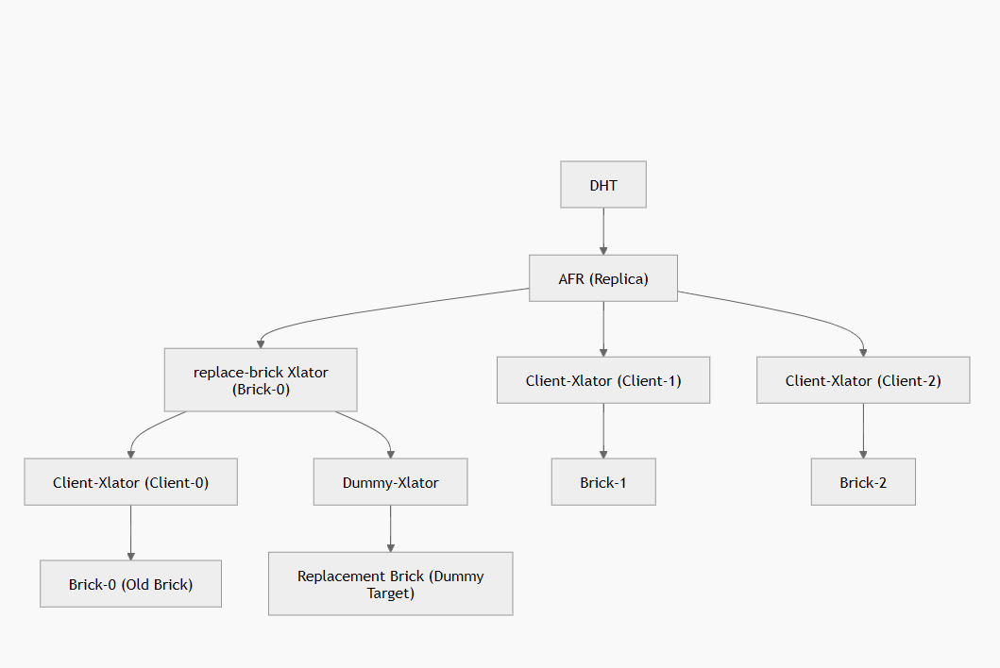
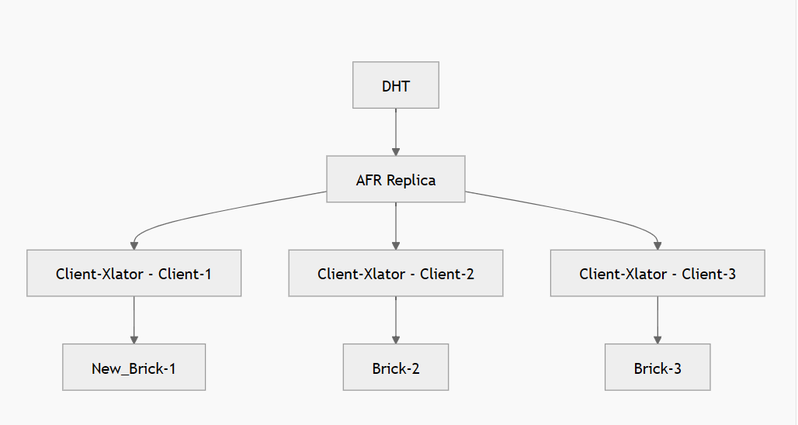

# Two-Phase Data-Preserving Brick Replacement Design

**Document Version:** 1.0  
**Date:** February 2026  
**Status:** Design Review  
**Authors:** Rafi KC

---

## Table of Contents

1. [Executive Summary](#executive-summary)
2. [Problem Statement](#problem-statement)
3. [Solution Overview](#solution-overview)
4. [Architecture](#architecture)
5. [Component Design](#component-design)
6. [Implementation Details](#implementation-details)
7. [State Machine & Workflows](#state-machine--workflows)
8. [Brick Down Scenarios During Phase 1](#brick-down-scenarios-during-phase-1-migration)
9. [Error Handling & Recovery](#error-handling--recovery)
10. [Simultaneous Replica Replacement](#simultaneous-replica-replacement)
11. [Translator Stack Comparison](#translator-stack-comparison)
12. [Conclusion](#conclusion)

## Two-Phase Brick Replacement Mechanism for GlusterFS

### Summary

This document describes a **two-phase brick replacement mechanism** for GlusterFS that enables **zero-redundancy-loss** hardware migration and node replacement scenarios.

Unlike the current `replace-brick` command, which immediately removes the old brick and temporarily risks replica protection and quorum safety, this design introduces a **transactional replacement workflow** that preserves redundancy, correctness, and stability throughout the lifecycle.

---

### Design Goals

- **Zero replica redundancy loss**
- **No AFR quorum disruption**
- **No heal/index noise during migration**
- **Crash-safe state persistence**
- **Support simultaneous multi-brick replacement**

---

### Key Innovation

The design introduces a new **`replace-brick` xlator**, positioned between AFR and the brick being replaced.

This xlator:

- Transparently routes **xattrop operations**
- Tracks **healed GFIDs**
- Maintains replacement delta state
- Avoids invasive AFR core modifications
- Enables **simultaneous multi-brick replacement** while maintaining quorum and AFR redundancy

---

### Operational Model

The replacement workflow is divided into two explicit phases.

---

### Phase 1 – Prepare / Migration

The replacement brick is added as a **candidate**, but remains logically hidden from AFR quorum and heal decisions.

#### Behavior

- Replacement brick connected but not part of AFR voting children
- Real brick continues serving reads/writes
- Replacement brick receives **self-accusing xattrops only**
- Background migration performs brick-to-brick copy

#### Validation Rules

Commit is rejected if:

- Pending heals exist where the old brick is the authoritative source

---

### High-Level Flow – Phase 1

**Before Prepare**

In the normal layout, AFR directly connects to the client xlator stack of each brick.



**After Prepare (Phase 1) – replace-brick xlator inserted**



Notes: The replace-brick xlator becomes a parent of the existing client stack for the brick being replaced; it has two children in Phase1: the real brick and a dummy replacement that receives self-accusing xattrops.

---

### Write Path Behavior

For mutating FOPs:

- Real Brick: Normal FOP execution
- Replacement Brick: Self-accusing xattrop entries

Guarantees delta tracking without duplicate writes.

---

### SHD / Heal Interaction

Self-heal operations affecting the old brick also generate xattrop markers on the replacement brick so the replacement accumulates healed GFIDs for validation.

---

### Brick Down Scenarios During Phase 1 Migration

The brick replacement mechanism must handle four distinct failure scenarios during Phase 1 (data migration):

#### Case 1: Other Replica Bricks Go Down (Brick-1 or Brick-2)

**Scenario:** One of the unaffected replica bricks (not the source or replacement brick) becomes unavailable.

**Behavior:**
- Normal AFR indices are generated on remaining live bricks
- The `replace-brick` xlator continues operating normally on its children
- Migration continues unaffected

**Commit Validation:**
- All **normal indices entries must be cleared** before commit (bricks healed or confirmed consistent)
- This ensures no pending heals block the topology switch
- If normal indices remain at commit time, the operation must be rejected to prevent data inconsistency if there is a chance that the quorum can't be met

#### Case 2: Old Brick (Source) Goes Down

**Scenario:** The brick being replaced becomes unavailable during Phase 1.

**Approach (Two Options):**

**Option A:** Treat `replace-brick` xlator as child-down (mimic old graph behavior)
- AFR routes around the failed brick
- Self-accusing indices captured by unaffected bricks (Brick-1, Brick-2)
- Replacement brick indices handled if heal is taken place

**Option B:** Fail operation inside the new replace-brick xlator with ENOTCONN
- Indices on the new brick can still be created for future recovery

**Index Handling:**
- Normal indices on Brick-1, Brick-2: Captured automatically by AFR
- Self-accusing indices on replacement brick: Generated by new xlator if available
- During Phase 1, healing naturally populates self-accusing indices on replacement brick
- Post-commit (Phase 2): Normal heal process resumes with replacement brick as AFR child
- Not strictly necessary to capture indices during source brick down—healing during Phase 2 restores consistency

#### Case 3: Replacement Brick (Destination) Goes Down

**Scenario:** The destination brick becomes unavailable during migration.

**Behavior:**
- Old brick continues serving normally
- Replacement brick becomes unreachable
- Migration pauses (destination unavailable)

**Index Handling Strategy:**
- Create a **special indices directory** within the replace-brick xlator's state (distinct from normal xattrop)
- **Do not** write to standard xattrop to avoid SHD treating these as pending heals
- Self-accusing entries logged in this special directory reference data needing transfer to replacement brick
- Old brick records which GFIDs require migration to the replacement brick

**Commit Validation:**
- Before commit, replacement brick **must be online and reachable**
- All special indices entries converted to actual data migration (or validated as complete)
- If replacement brick remains unavailable at commit time, the operation **must be rejected**
- Alternatively: Abort the operation if replacement brick failure is prolonged

**Recovery:**
- Once replacement brick recovers, migration resumes from the special indices
- No interference with normal SHD healing

#### Case 4: Both Source and Replacement Bricks Down

**Scenario:** Both the old brick and replacement brick are unavailable simultaneously.

**Behavior:**
- Treat the entire `replace-brick` xlator as child-down
- Mimics the behavior of losing a replica in the original graph
- AFR continues with remaining healthy bricks (Brick-1, Brick-2)

**Index Handling:**
- Normal AFR indices captured on remaining bricks
- Both source and destination state is unavailable
- Operation should be aborted or put into a suspended state

**Commit:**
- Commit is **blocked** until new bricks are restored
- Recovery pathway: Restart bricks, resume migration, and proceed to Phase 2

---

### Summary of Index Clearing Before Commit

Before transitioning from Phase 1 to Phase 2, the following **must be validated:**

1. **Normal AFR indices cleared:** No pending heals on unaffected bricks
2. **Special indices for Case 3 drained:** All migration entries processed or confirmed
3. **Old brick not authoritative:** No pending heals where source brick is the primary
4. **Replacement brick fully migrated:** All required data transferred and validated

Failure to satisfy any condition **blocks commit** to preserve data integrity.

---

### Phase 2 – Commit

After migration completes and validations pass, commit performs atomic topology switch.

#### Critical Safety Rule

Verify **no pending heals** where old brick is source.

---

### High-Level Flow – Phase 2

**After Commit (Phase 2) – Old brick disconnected, replacement brick becomes active AFR child**



---

### Failure Handling

- Replacement brick failure → Non-fatal in Phase 1 (indices persisted locally)
- Migration failure → Abort / Retry
- Glusterd restart → Recover persisted state and resume migration
- Replacement recovery → Replay indices to replacement brick

---

### Simultaneous Replica Replacement

Because the logic is encapsulated in the `replace-brick` xlator and it uses per-brick indices, multiple bricks in the same replica set can be replaced concurrently without AFR core changes.

---

### Advantages of Xlator Approach

✓ No AFR core changes  
✓ Clean isolation  
✓ Deterministic recovery  
✓ Minimal client impact  
✓ Multi-brick replacement supported

---

### Translator Stack Comparison

Normal stack (before replace):

```text
AFR
 └─ Client-Xlator
    └─ Brick (old)
```

Replacement stack (Phase 1):

```text
AFR
 └─ replace-brick
    ├─ Client-Xlator → Brick (old)
    └─ Dummy-Xlator  → Dummy (replacement)
```

After commit (Phase 2):

```text
AFR
 └─ Client-Xlator
    └─ Brick (new)
```

---

### Conclusion

Brick replacement becomes a transactional, redundancy-preserving operation suitable for production migrations using this two-phase approach and the `replace-brick` xlator.
